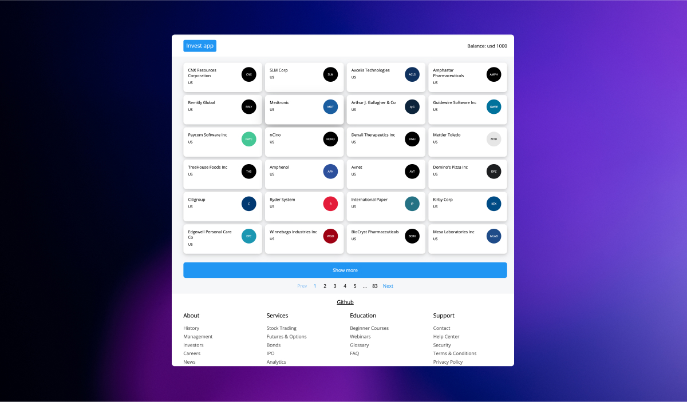
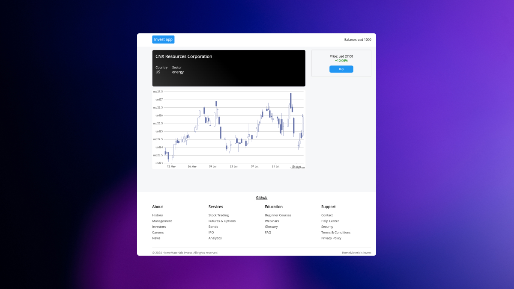

# SSR Financial Application

This is a financial application built with Next.js, utilizing Server-Side Rendering (SSR). It provides financial data visualization using various charting libraries [details](https://dev.to/u4aew/creating-an-ssr-application-on-nextjs-14-7bf).





## Table of Contents

- [Installation](#installation)
- [Scripts](#scripts)
- [Features](#features)
- [Dependencies](#dependencies)
- [Development](#development)
- [License](#license)

## Installation

1. Clone the repository:

   ```bash
   git clone <repository-url>
   cd ssr
   ```

2. Install the dependencies:

   ```bash
   npm install
   ```

## Scripts

- **Development:** Start the development server.

  ```bash
  npm run dev
  ```

- **Build:** Create an optimized production build.

  ```bash
  npm run build
  ```

- **Start:** Start the production server on port 6060.

  ```bash
  npm run start
  ```

- **Lint:** Run ESLint for code quality checks.

  ```bash
  npm run lint
  ```

## Features

- **Server-Side Rendering (SSR):** Improve SEO and initial page load time.
- **Financial Charts:** Visualize financial data using CanvasJS.
- **State Management:** Manage application state using Redux Toolkit.
- **Styled with SASS:** Use SASS for styling components.

## Dependencies

- **Next.js:** Framework for server-rendered React applications.
- **React & React-DOM:** Core libraries for building user interfaces.
- **Redux Toolkit:** Simplified Redux state management.
- **Axios:** Promise-based HTTP client for making API requests.
- **CanvasJS Charts:** Library for creating interactive charts.
- **Classnames:** Utility for conditionally joining classNames.
- **SASS:** CSS preprocessor for styling.

## Development

This project uses TypeScript for type safety and ESLint for maintaining code quality. Prettier is used for code formatting.

## License

This project is licensed under the MIT License.
